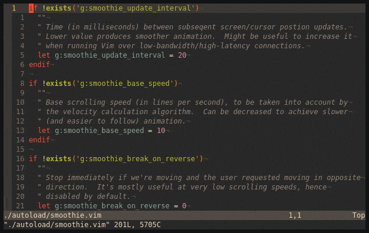

About This Fork
==================================================
This is a forked version containing:
* Merged upstream
* Changes from toombs-caeman's branch (`n`, `N` smooth scrolling)
* Option to hide cursor
* Smooth scrolling extra commands: `H`, `M`, `L`, `{`, `}`
* Smooth scrolling with the Scroll Wheel
* Smooth scrolling `j` and `k` when prefixed with a number
* Remove "experimental" option
* Updated README

vim-smoothie: Smooth scrolling for Vim done right🥤
===================================================

This (neo)vim plugin makes scrolling nice and _smooth_. Find yourself
completely lost every time you press `Ctrl-D` or `Ctrl-F`? You might want to
give _vim-smoothie_ a try!



Requirements
------------

You will need reasonably new Vim or Neovim. Vim 8.2.1978+ or Neovim 0.3+ should
do the trick.

Additionally, since this plugins due to its nature causes frequent screen
redraws, it is recommended to use a fast terminal emulator, ideally with GPU
acceleration. I personally recommend [kitty].

Installation
------------

Install the plugin using your favorite plugin manager, for example [vim-plug]:
```vim
Plug 'psliwka/vim-smoothie'
```

Customization
-------------

_vim-smoothie_ aims for sane defaults, and should work out-of-the-box for most
users. In some cases, however, you might want to customize its behavior, by
adjusting one or more of the following variables in your `vimrc`:

* `g:smoothie_enabled`: Set it to `0` (or `v:false`) to disable vim-smoothie.
  Useful for temporary disabling the plugin, f.ex. when running Vim over
  extremely slow connections.
* `g:smoothie_no_default_mappings`: If true, will prevent the plugin from
  overriding default scrolling keys (`Ctrl-D` and friends). You are then
  supposed to bind keys you like by yourself. Example mapping:
  ```vim
  nnoremap <unique> <C-D> <cmd>call smoothie#do("\<C-D>") <CR>
  vnoremap <unique> <C-D> <cmd>call smoothie#do("\<C-D>") <CR>
  ```
  Note that the same key is mapped twice (with `nnoremap` and `vnoremap`) to
  make the binding work in Visual mode too.
* `g:smoothie_remapped_commands`: Instead of disabling all mappings with
  `g:smoothie_no_default_mappings`, you can disable them selectively by
  overriding this list with a subset of commands that you'd like to map.
  Alternatively, you can add extra commands here if you fell extra adventurous
  ;)

  Default list of enabled mappings: `['<C-D>', '<C-U>', '<C-F>', '<S-Down>', '<PageDown>', '<C-B>', '<S-Up>', '<PageUp>', 'z+', 'z^', 'zt', 'z<CR>', 'z.', 'zz', 'z-', 'zb', 'H', 'M', 'L', '{', '}', 'j', 'k', '<ScrollWheelDown>', '<ScrollWheelUp>', 'gg', 'G', 'n', 'N', '#', '*', 'g*', 'g#']`
* `g:smoothie_hide_cursor`: (default: `1`) Hide the cursor while scrolling.

The following options were originally removed from the README by psliwka [#22](https://github.com/psliwka/vim-smoothie/issues/22):
* `g:smoothie_speed_linear_factor`: (default: `25`) This value controls linear term of the velocity curve. Increasing this
  boosts primarily cursor speed at the beginning of animation. **This is likely the first value you'd wanna change to increase scroll speed.**
* `g:smoothie_speed_exponentiation_factor`: (default: `0.7`) This value controls exponent of the power function in the velocity curve.
  Generally should be less or equal to 1.0. Lower values produce longer but
  perceivably smoother animation.
* `g:smoothie_speed_constant_factor`: (default: `10`) This value controls constant term of the velocity curve. Increasing this
  boosts primarily cursor speed at the end of animation.
* `g:smoothie_update_interval`: (default: `5`) Time (in milliseconds) between subsequent screen/cursor position updates.
  Lower value produces smoother animation.  Might be useful to increase it
  when running Vim over low-bandwidth/high-latency connections.
* `g:smoothie_redraw_at_finish`: Force screen redraw when the animation is finished, which clears sporadic
  display artifacts which I encountered f.ex. when scrolling through buffers
  containing emoji. Enabled by default only if both editor and terminal (kitty)
  supports doing this in a glitch-free way.

The plugin also respects native Vim settings affecting scrolling behavior, such
as `scrolloff`, `belloff`, `startofline`, etc.

Alternatives, a.k.a. why create yet another plugin
--------------------------------------------------

There are many other Vim plugins attempting to resolve the same problem. The
most interesting one is [sexy_scroller.vim], which covers way more movement
commands than vim-smoothie will ever do. Unfortunately, it also suffers from
frequent visual artifacts, such as erratic screen jumps and animation
jittering, impairing visual orientation and breaking the user experience. Many
of these bugs are nearly impossible to fix due to the plugin's internal design.
Hence, vim-smoothie was born, focusing on stable, bug-free, _smooth_
experience, at a cost of smaller feature set.

The table below summarizes key differences between vim-smoothie and three other
popular smooth scrolling plugins I've used in the past: [sexy_scroller.vim],
[comfortable-motion.vim], and [vim-smooth-scroll].

|  | vim-smoothie | [sexy_scroller.vim] | [comfortable-motion.vim] | [vim-smooth-scroll] |
|---|:---:|:---:|:---:|:---:|
| Supported commands | All window scrolling commands (`^D` `^U` `^F` `^B` `zz` `zt` `zb` etc.), `gg`<sup>1</sup> `G`<sup>1</sup> `n`<sup>1</sup> `N`<sup></sup> | Almost all window and cursor movement commands ❤️ | `^D` `^U` `^F` `^B` | `^D` `^U` `^F` `^B` |
| Erratic screen jumps and jittering now and then | Nope | A lot💔 | Nope | Nope |
| Scrolling distance is proportional to window height | ✅ | ✅ | ❌ | ✅ |
| Easing out (soft-stop) | ✅ | ✅ | ✅ | ❌ |
| Supports setting `[count]` before movement (f.ex. `3^F` to scroll down 3 pages) | ✅ | ✅ | ❌ | ❌ |
| Respects `scroll` and `startofline` options | ✅ | ✅ | ❌ | ❌ |
| `^D` and `^U` behave correctly near buffer ends, just moving the cursor instead of scrolling the window | ✅ | ✅ | ❌ | ❌ |
| Terminal bell support | ✅ | ✅ | ❌ | ❌ |
| Pun in name | ✅ | ✅ | ❌ | ❌ |

Notes:
1. these commands are experimental and disabled by default

Credits
-------

Created by [Piotr Śliwka](https://github.com/psliwka). Improved by
[Klas Segeljakt](https://github.com/segeljakt) and
[Subhaditya Nath](https://github.com/subnut).

Many thanks to authors of [vim-smooth-scroll], [comfortable-motion.vim], and
[sexy_scroller.vim] for inspiration!

License
-------

[MIT](LICENSE)

[vim-plug]: https://github.com/junegunn/vim-plug
[vim-smooth-scroll]: https://github.com/terryma/vim-smooth-scroll
[comfortable-motion.vim]: https://github.com/yuttie/comfortable-motion.vim
[sexy_scroller.vim]: https://github.com/joeytwiddle/sexy_scroller.vim
[kitty]: https://github.com/kovidgoyal/kitty
